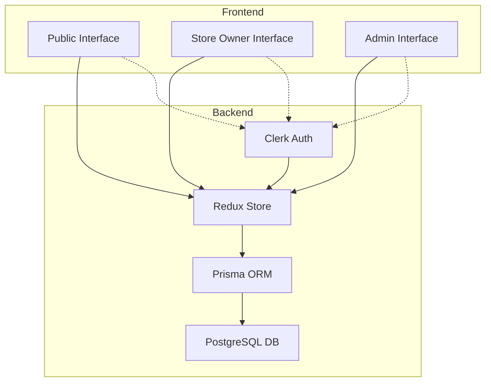
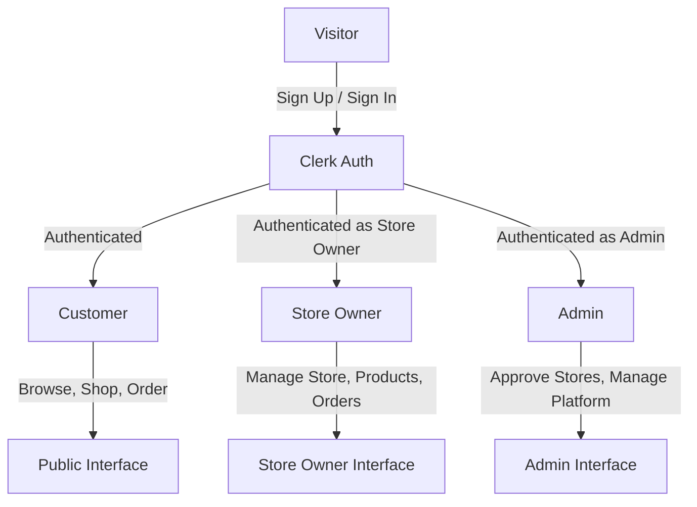
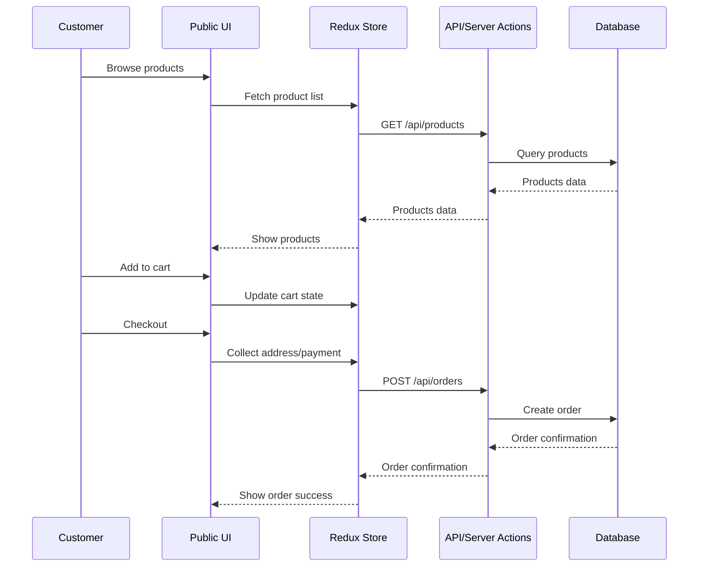
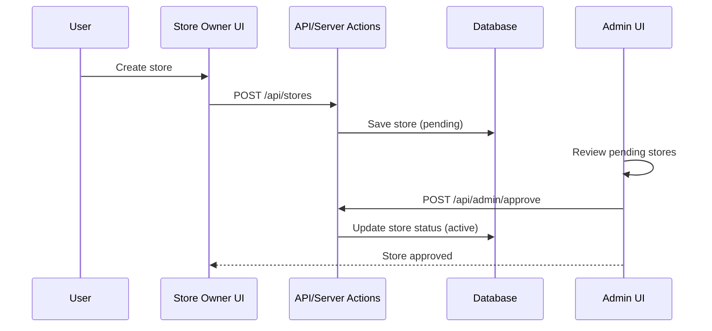
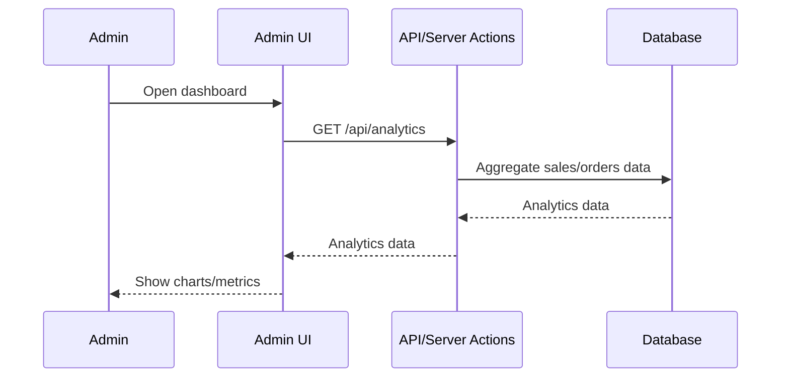
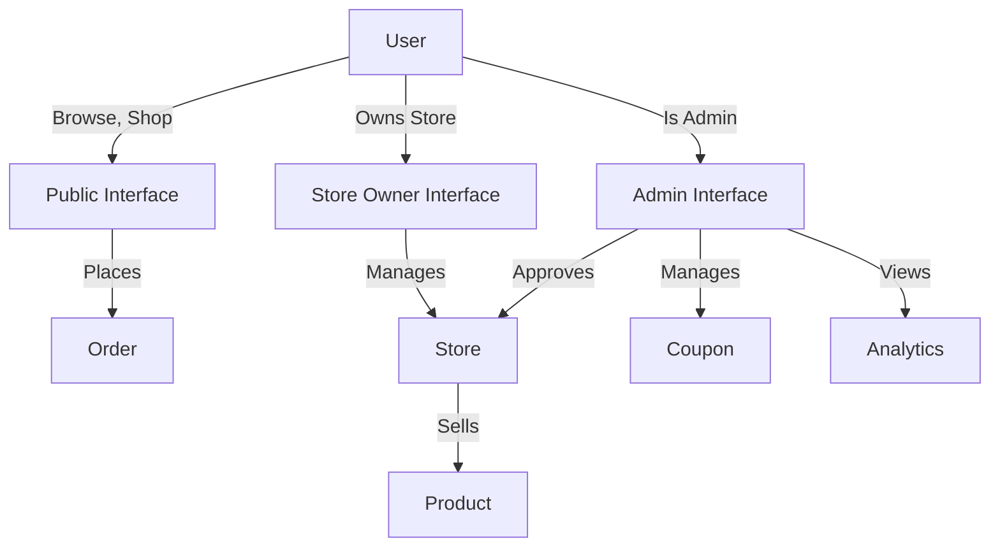
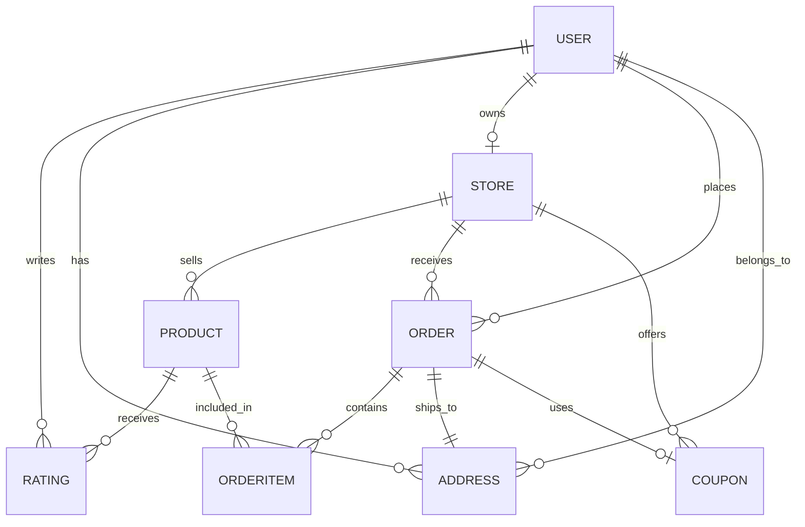

<div align="center">
  <h1>GoCart</h1>
  <p>
    Full Stack AI multi-vendor e-commerce platform built with Next.js | PERN Stack project
  </p>
  <p>
    <a href=""></a>
    <a href=""></a>
    <a href=""></a>
  </p>
</div>

---

## 📖 Table of Contents
- [Features](#-features)
- [Technology Stack](#technology-stack)
- [Getting Started](#getting-started)
- [Architecture](#architecture)
- [Data Flow & Graphs](#data-flow--graphs)
- [API Reference](#api-reference)
- [Contact](#contact)

---

## Features

- **Multi-Vendor Architecture:** Allows multiple vendors to register, manage their own products, and sell on a single platform.
- **Customer-Facing Storefront:** A beautiful and responsive user interface for customers to browse and purchase products.
- **Vendor Dashboards:** Dedicated dashboards for vendors to manage products, view sales analytics, and track orders.
- **Admin Panel:** A comprehensive dashboard for platform administrators to oversee vendors, products, and commissions.

| Feature                        | Customer | Store Owner | Admin |
|------------------------------- |:--------:|:-----------:|:-----:|
| Product Browsing & Search      |    ✅    |      ✅      |   ✅  |
| Shopping Cart                  |    ✅    |      ✅      |   ❌  |
| Order Placement & Tracking     |    ✅    |      ✅      |   ✅  |
| Store Management               |    ❌    |      ✅      |   ✅  |
| Product Management             |    ❌    |      ✅      |   ✅  |
| Order Fulfillment              |    ❌    |      ✅      |   ✅  |
| Analytics Dashboard            |    ❌    |      ✅      |   ✅  |
| Reviews & Ratings              |    ✅    |      ✅      |   ✅  |
| Coupon Management              |    ❌    |      ❌      |   ✅  |
| Store Approval                 |    ❌    |      ❌      |   ✅  |
| User Management                |    ❌    |      ❌      |   ✅  |
| Responsive Design              |    ✅    |      ✅      |   ✅  |

---

## 🛠️ Tech Stack <a name="-tech-stack"></a>

GoCart leverages a modern, robust technology stack to deliver a seamless, scalable, and secure multi-vendor e-commerce experience. Each technology is carefully chosen for its strengths and role in the platform:

| Layer                | Technology            | Version     | Purpose & Why We Use It                                                                 |
|----------------------|----------------------|-------------|----------------------------------------------------------------------------------------|
| **Framework**        | Next.js              | 15.3.5      | Full-stack React framework with App Router for SSR, routing, and API routes             |
| **Frontend**         | React                | 19.0.0      | Component-based UI library for building interactive interfaces                          |
| **State Management** | Redux Toolkit        | 2.8.2       | Predictable, scalable global state management                                           |
| **Authentication**   | Clerk                | 6.32.0      | Secure, modern authentication and user/session management                               |
| **Database**         | PostgreSQL           | -           | Reliable, scalable relational database                                                 |
| **ORM**              | Prisma               | -           | Type-safe database access and schema management                                         |
| **Styling**          | Tailwind CSS         | 4.x         | Utility-first CSS for rapid, responsive, and consistent UI                              |
| **Icons**            | Lucide React         | 0.525.0     | Modern, customizable icon library                                                      |
| **Notifications**    | React Hot Toast      | 2.5.2       | Toast notifications for user feedback                                                  |
| **Charts**           | Recharts             | 3.1.2       | Data visualization for analytics and dashboards                                        |
| **Date Handling**    | Date-fns             | 4.1.0       | Modern date utility functions                                                          |


## 🚀 Getting Started <a name="-getting-started"></a>

```bash
npm install
```

```bash
.env
```

```bash
npx prisma migrate dev
npx prisma generate
```

```bash
npm run dev
```

## 📂 File & Data Flow Overview

```mermaid
flowchart TD
    APPLAYOUT["app/layout.jsx"]
    STOREPROVIDER["app/StoreProvider.js"]
    PUBLICLAYOUT["app/(public)/layout.jsx"]
    ADMINLAYOUT["app/admin/layout.jsx"]
    STORELAYOUT["app/store/layout.jsx"]
    PUBLICPAGES["app/(public)/*"]
    ADMINPAGES["app/admin/*"]
    STOREPAGES["app/store/*"]
    NAVBAR["components/Navbar.jsx"]
    FOOTER["components/Footer.jsx"]
    PRODUCTCARD["components/ProductCard.jsx"]
    ORDERITEM["components/OrderItem.jsx"]
    ADDRESSMODAL["components/AddressModal.jsx"]
    ADMINCOMP["components/admin/*"]
    STORECOMP["components/store/*"]
    STORE["lib/store.js"]
    CARTSLICE["lib/features/cart/cartSlice.js"]
    PRODUCTSLICE["lib/features/product/productSlice.js"]
    ADDRESSSLICE["lib/features/address/addressSlice.js"]
    RATINGS["lib/features/rating/ratingSlice.js"]
    CLERK["ClerkProvider"]
    MIDDLEWARE["middleware.ts"]
    PRISMA["lib/prisma.js"]
    SCHEMA["prisma/schema.prisma"]
    ASSETS["assets/assets.js"]
    APPLAYOUT --> CLERK
    CLERK --> STOREPROVIDER
    STOREPROVIDER --> STORE
    STORE --> CARTSLICE
    STORE --> PRODUCTSLICE
    STORE --> ADDRESSSLICE
    STORE --> RATINGS
    APPLAYOUT --> PUBLICLAYOUT
    APPLAYOUT --> ADMINLAYOUT
    APPLAYOUT --> STORELAYOUT
    PUBLICLAYOUT --> NAVBAR
    PUBLICLAYOUT --> FOOTER
    PUBLICLAYOUT --> PUBLICPAGES
    ADMINLAYOUT --> ADMINCOMP
    ADMINLAYOUT --> ADMINPAGES
    STORELAYOUT --> STORECOMP
    STORELAYOUT --> STOREPAGES
    PUBLICPAGES -->|"import/use"| PRODUCTCARD
    PUBLICPAGES -->|"import/use"| ORDERITEM
    PUBLICPAGES -->|"import/use"| ADDRESSMODAL
    ADMINPAGES -->|"import/use"| ADMINCOMP
    STOREPAGES -->|"import/use"| STORECOMP
    NAVBAR -->|"router.push"| PUBLICPAGES
    NAVBAR -->|"router.push"| PUBLICPAGES
    PUBLICPAGES -->|"useSelector"| CARTSLICE
    PUBLICPAGES -->|"useSelector"| PRODUCTSLICE
    PUBLICPAGES -->|"useSelector"| ADDRESSSLICE
    PUBLICPAGES -->|"useSelector"| RATINGS
    ADMINPAGES -->|"useSelector"| PRODUCTSLICE
    STOREPAGES -->|"useSelector"| PRODUCTSLICE
    STOREPAGES -->|"useSelector"| CARTSLICE
    STOREPAGES -->|"fetch"| ASSETS
    STOREPAGES -->|"fetch"| PRISMA
    ADMINPAGES -->|"fetch"| PRISMA
    MIDDLEWARE --> CLERK
    PRISMA --> SCHEMA
    STOREPROVIDER -->|"Provider"| PUBLICPAGES
    STOREPROVIDER -->|"Provider"| ADMINPAGES
    STOREPROVIDER -->|"Provider"| STOREPAGES
    PUBLICPAGES -->|"router.push"| PUBLICPAGES
    STOREPAGES -->|"router.push"| STOREPAGES
    ADMINPAGES -->|"router.push"| ADMINPAGES
```


*Figure: Major file/module connections, Redux state, Clerk auth, and navigation/data flow. Arrows show imports, usage, and data/API flow between files.*

## Purpose and Scope
GoCart is a sophisticated multi-vendor e-commerce platform that enables customers to shop from multiple stores, store owners to manage their own products and orders, and admins to oversee the entire marketplace. The system provides three distinct user experiences:
- **Public Interface**: Customer browsing, shopping cart management, and order placement
- **Store Owner Interface**: Product management, inventory control, and order fulfillment
- **Admin Interface**: Platform management, store approval, and system-wide analytics

The platform supports complex multi-vendor scenarios, including separate order processing per store, individual store ratings, coupon management, and comprehensive order tracking across different vendors.

---

## 🎯 Purpose & Scope
GoCart is a next-generation, multi-vendor e-commerce platform designed for:
- **Customers:**
  - Browse and search products across multiple stores
  - Manage shopping cart and place orders
  - Track orders and leave product/store reviews
- **Store Owners:**
  - Create and manage their own store
  - Add, edit, and manage products and inventory
  - Fulfill and track orders, view analytics
- **Admins:**
  - Approve and manage stores
  - Oversee platform-wide analytics and user management
  - Manage coupons, promotions, and platform settings

GoCart is built for scalability, modularity, and a seamless user experience, making it ideal for both small businesses and large marketplaces.

---

## 🏗️ Architecture
GoCart is architected for modularity and scalability, with clear separation between public, store owner, and admin interfaces. Centralized state management and a robust database schema ensure data consistency and performance.

### High-Level System Architecture

*Figure: Modular interfaces, centralized state, and authentication flow.*

### User Flow Diagram

*Figure: User authentication and interface access flow.*

---

## 🔍 How It Works

### 1. Customer Checkout Flow
A customer browses products, adds items to the cart, and completes checkout with address and payment selection.



### 2. Store Approval (Admin)
A new store is created by a user and must be approved by an admin before going live.



### 3. Admin Analytics Flow
Admin views platform-wide analytics, including sales, orders, and store performance.



---

## 👤 User Role Access Flow


*Figure: User role flow and permissions across the platform.*

---

## 🗄️ Detailed Data Model (Entity Relationship)


*Figure: Entity relationship diagram for users, stores, products, orders, and coupons.*

---

### Development Workflow

1. **Database Management**
   - Use Prisma Studio: `npx prisma studio`
   - Reset database: `npx prisma migrate reset`

2. **State Management**
   - Redux DevTools integration for debugging
   - Slice-based state organization

3. **Authentication**
   - Clerk dashboard for user management
   - Middleware-based route protection

## 🔧 Configuration

### Environment Variables


### Database Configuration

### Customer Experience
- Browse products by categories
- Advanced search functionality
- Shopping cart with quantity management
- Secure checkout process
- Order tracking and history
- Product reviews and ratings

### Seller Dashboard
- Store profile management
- Product inventory control
- Order fulfillment tracking
- Sales analytics and reporting
- Customer review management

### Administrative Control
- Store approval workflow
- Platform-wide analytics
- Coupon and promotion management
- User account oversight
- Revenue tracking

## 🛡️ Security Features

- **Authentication**: Clerk-based secure authentication
- **Route Protection**: Middleware-based access control
- **Data Validation**: Prisma schema validation
- **SQL Injection Protection**: Prisma ORM safety
- **CSRF Protection**: Next.js built-in protection

## 📱 Responsive Design

- Mobile-first responsive design
- Tailwind CSS utility classes
- Flexible grid layouts
- Touch-friendly interfaces
- Progressive Web App capabilities

## 🔄 State Management Architecture

### Redux Store Structure [25](#0-24) 

The application uses Redux Toolkit for predictable state management with separate slices for different features, ensuring scalable and maintainable code architecture.

### Citations

**File:** app/layout.jsx (L1-7)
```javascript
import { Outfit } from "next/font/google";
import { Toaster } from "react-hot-toast";
import StoreProvider from "@/app/StoreProvider";
import "./globals.css";
import { ClerkProvider } from "@clerk/nextjs";

const outfit = Outfit({ subsets: ["latin"], weight: ["400", "500", "600"] });
```

**File:** app/layout.jsx (L9-12)
```javascript
export const metadata = {
    title: "GoCart. - Shop smarter",
    description: "GoCart. - Shop smarter",
};
```

**File:** app/layout.jsx (L16-26)
```javascript
        <ClerkProvider>
            <html lang="en">
                <body className={`${outfit.className} antialiased`}>
                    <StoreProvider>
                        <Toaster />
                        {children}
                    </StoreProvider>
                </body>
            </html>
        </ClerkProvider>
    );
```

**File:** lib/store.js (L1-15)
```javascript
import { configureStore } from '@reduxjs/toolkit'
import cartReducer from './features/cart/cartSlice'
import productReducer from './features/product/productSlice'
import addressReducer from './features/address/addressSlice'
import ratingReducer from './features/rating/ratingSlice'

export const makeStore = () => {
    return configureStore({
        reducer: {
            cart: cartReducer,
            product: productReducer,
            address: addressReducer,
            rating: ratingReducer,
        },
    })
```

**File:** prisma/schema.prisma (L1-10)
```text
generator client {
    provider        = "prisma-client-js"
    previewFeatures = ["driverAdapters"]
}

datasource db {
    provider  = "postgresql"
    url       = env("DATABASE_URL")
    directUrl = env("DIRECT_URL")
}
```

**File:** prisma/schema.prisma (L13-25)
```text
model User {
    id    String @id
    name  String
    email String
    image String
    cart  Json   @default("{}")

    // Relations
    ratings     Rating[]
    Address     Address[]
    store       Store?
    buyerOrders Order[]   @relation("BuyerRelation")
}
```

**File:** prisma/schema.prisma (L28-45)
```text
model Product {
    id          String   @id @default(cuid())
    name        String
    description String
    mrp         Float
    price       Float
    images      String[]
    category    String
    inStock     Boolean  @default(true)
    storeId     String
    createdAt   DateTime @default(now())
    updatedAt   DateTime @updatedAt

    // Relations
    store      Store       @relation(fields: [storeId], references: [id], onDelete: Cascade)
    orderItems OrderItem[]
    rating     Rating[]
}
```

**File:** prisma/schema.prisma (L47-52)
```text
enum OrderStatus {
    ORDER_PLACED
    PROCESSING
    SHIPPED
    DELIVERED
}
```

**File:** prisma/schema.prisma (L54-57)
```text
enum PaymentMethod {
    COD
    STRIPE
}
```

**File:** prisma/schema.prisma (L60-79)
```text
model Order {
    id            String        @id @default(cuid())
    total         Float
    status        OrderStatus   @default(ORDER_PLACED)
    userId        String
    storeId       String
    addressId     String
    isPaid        Boolean       @default(false)
    paymentMethod PaymentMethod
    createdAt     DateTime      @default(now())
    updatedAt     DateTime      @updatedAt
    isCouponUsed  Boolean       @default(false)
    coupon        Json          @default("{}")
    orderItems    OrderItem[]

    // Relations
    user    User    @relation("BuyerRelation", fields: [userId], references: [id])
    store   Store   @relation(fields: [storeId], references: [id])
    address Address @relation(fields: [addressId], references: [id])
}
```

**File:** prisma/schema.prisma (L145-162)
```text
model Store {
    id          String   @id @default(cuid())
    userId      String   @unique
    name        String
    description String
    username    String   @unique
    address     String
    status      String   @default("pending")
    isActive    Boolean  @default(false)
    logo        String
    email       String
    contact     String
    createdAt   DateTime @default(now())
    updatedAt   DateTime @updatedAt

    Product Product[]
    Order   Order[]
    user    User      @relation(fields: [userId], references: [id])
```

**File:** middleware.ts (L1-12)
```typescript
import { clerkMiddleware } from '@clerk/nextjs/server';

export default clerkMiddleware();

export const config = {
  matcher: [
    // Skip Next.js internals and all static files, unless found in search params
    '/((?!_next|[^?]*\\.(?:html?|css|js(?!on)|jpe?g|webp|png|gif|svg|ttf|woff2?|ico|csv|docx?|xlsx?|zip|webmanifest)).*)',
    // Always run for API routes
    '/(api|trpc)(.*)',
  ],
};
```

**File:** app/(public)/layout.jsx (L6-16)
```javascript
export default function PublicLayout({ children }) {

    return (
        <>
            <Banner />
            <Navbar />
            {children}
            <Footer />
        </>
    );
}
```

**File:** app/(public)/page.jsx (L8-18)
```javascript
export default function Home() {
    return (
        <div>
            <Hero />
            <LatestProducts />
            <BestSelling />
            <OurSpecs />
            <Newsletter />
        </div>
    );
}
```

**File:** components/Navbar.jsx (L24-52)
```javascript
    return (
        <nav className="relative bg-white">
            <div className="mx-6">
                <div className="flex items-center justify-between max-w-7xl mx-auto py-4  transition-all">

                    <Link href="/" className="relative text-4xl font-semibold text-slate-700">
                        <span className="text-green-600">go</span>cart<span className="text-green-600 text-5xl leading-0">.</span>
                        <p className="absolute text-xs font-semibold -top-1 -right-8 px-3 p-0.5 rounded-full flex items-center gap-2 text-white bg-green-500">
                            plus
                        </p>
                    </Link>

                    {/* Desktop Menu */}
                    <div className="hidden sm:flex items-center gap-4 lg:gap-8 text-slate-600">
                        <Link href="/">Home</Link>
                        <Link href="/shop">Shop</Link>
                        <Link href="/">About</Link>
                        <Link href="/">Contact</Link>

                        <form onSubmit={handleSearch} className="hidden xl:flex items-center w-xs text-sm gap-2 bg-slate-100 px-4 py-3 rounded-full">
                            <Search size={18} className="text-slate-600" />
                            <input className="w-full bg-transparent outline-none placeholder-slate-600" type="text" placeholder="Search products" value={search} onChange={(e) => setSearch(e.target.value)} required />
                        </form>

                        <Link href="/cart" className="relative flex items-center gap-2 text-slate-600">
                            <ShoppingCart size={18} />
                            Cart
                            <button className="absolute -top-1 left-3 text-[8px] text-white bg-slate-600 size-3.5 rounded-full">{cartCount}</button>
                        </Link>
```

**File:** app/store/page.jsx (L23-28)
```javascript
    const dashboardCardsData = [
        { title: 'Total Products', value: dashboardData.totalProducts, icon: ShoppingBasketIcon },
        { title: 'Total Earnings', value: currency + dashboardData.totalEarnings, icon: CircleDollarSignIcon },
        { title: 'Total Orders', value: dashboardData.totalOrders, icon: TagsIcon },
        { title: 'Total Ratings', value: dashboardData.ratings.length, icon: StarIcon },
    ]
```

**File:** components/store/StoreLayout.jsx (L29-39)
```javascript
    ) : isSeller ? (
        <div className="flex flex-col h-screen">
            <SellerNavbar />
            <div className="flex flex-1 items-start h-full overflow-y-scroll no-scrollbar">
                <SellerSidebar storeInfo={storeInfo} />
                <div className="flex-1 h-full p-5 lg:pl-12 lg:pt-12 overflow-y-scroll">
                    {children}
                </div>
            </div>
        </div>
    ) : (
```

**File:** app/admin/page.jsx (L21-26)
```javascript
    const dashboardCardsData = [
        { title: 'Total Products', value: dashboardData.products, icon: ShoppingBasketIcon },
        { title: 'Total Revenue', value: currency + dashboardData.revenue, icon: CircleDollarSignIcon },
        { title: 'Total Orders', value: dashboardData.orders, icon: TagsIcon },
        { title: 'Total Stores', value: dashboardData.stores, icon: StoreIcon },
    ]
```

**File:** components/admin/AdminLayout.jsx (L26-34)
```javascript
        <div className="flex flex-col h-screen">
            <AdminNavbar />
            <div className="flex flex-1 items-start h-full overflow-y-scroll no-scrollbar">
                <AdminSidebar />
                <div className="flex-1 h-full p-5 lg:pl-12 lg:pt-12 overflow-y-scroll">
                    {children}
                </div>
            </div>
        </div>
```

**File:** lib/features/cart/cartSlice.js (L3-15)
```javascript
const cartSlice = createSlice({
    name: 'cart',
    initialState: {
        total: 0,
        cartItems: {},
    },
    reducers: {
        addToCart: (state, action) => {
            const { productId } = action.payload
            if (state.cartItems[productId]) {
                state.cartItems[productId]++
            } else {
                state.cartItems[productId] = 1
```

**File:** assets/assets.js (L31-31)
```javascript
export const categories = ["Headphones", "Speakers", "Watch", "Earbuds", "Mouse", "Decoration"];
```

**File:** app/StoreProvider.js (L6-13)
```javascript
export default function StoreProvider({ children }) {
  const storeRef = useRef(undefined)
  if (!storeRef.current) {
    // Create the store instance the first time this renders
    storeRef.current = makeStore()
  }

  return <Provider store={storeRef.current}>{children}</Provider>
```

---

## 📚 API Reference
GoCart exposes a set of RESTful API endpoints and server actions for data access and management. Below are some example endpoints (expand as you add more):

| Endpoint                | Method | Description                        | Request Body / Params         | Response Example              |
|-------------------------|--------|------------------------------------|-------------------------------|-------------------------------|
| `/api/products`         | GET    | Get all products                   | -                             | `[ { id, name, price, ...} ]` |
| `/api/products/:id`     | GET    | Get product by ID                  | `id` (URL param)              | `{ id, name, price, ... }`    |
| `/api/orders`           | POST   | Create a new order                 | `{ cart, address, payment }`  | `{ orderId, status, ... }`    |
| `/api/orders/:id`       | GET    | Get order details                  | `id` (URL param)              | `{ orderId, items, ... }`     |
| `/api/stores`           | POST   | Create a new store                 | `{ name, description, ... }`  | `{ storeId, status, ... }`    |
| `/api/admin/approve`    | POST   | Approve a store (admin only)       | `{ storeId }`                 | `{ success: true }`           |

> _For a full list of endpoints and server actions, see the `/app/api/` directory and server action files._

---

## 📬 Contact

- **Email:** [your-email@example.com](nikhilsutar81@gmail.com)
- **Project Repo:** [GoCart on GitHub](https://github.com/nikhilsutar81/GoCart)

> _We welcome feedback, questions, and collaboration!_

---
